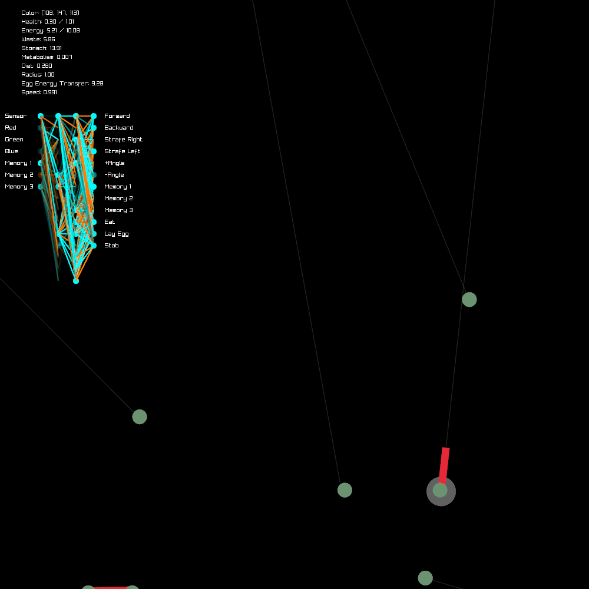
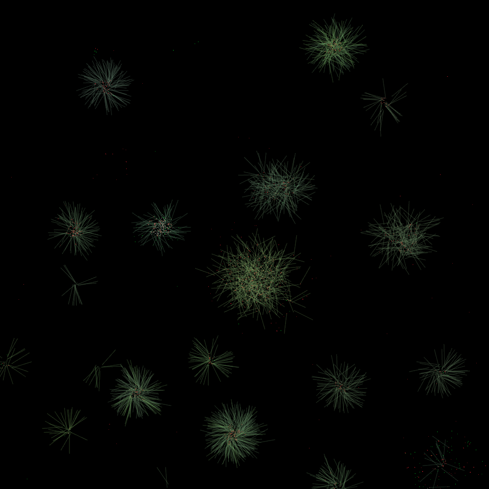

# Meat Colony
Meat colony is a closed energy system artificial life simulator.

Each 'cell' has various genetic traits like size, metabolism, diet, speed, color, and their 'brain' (a small neural network).

Cell only get input in the form of single vision ray which tells them the distance and color of whatever is in their vision ray.

If a cell has enough energy, it can lay an egg which will eventually hatch into a new cell with nearly identical DNA.

As a cell moves around and does other things that use energy, the used energy turns into wast will later be deposited back into the ecosystem to grow new plants.

When a cell dies, its energy it turns into meat which is much more efficient to digest than plants.

Cells can also 'stab' to damage any cells within their attack range (this appears visually as a red line)

